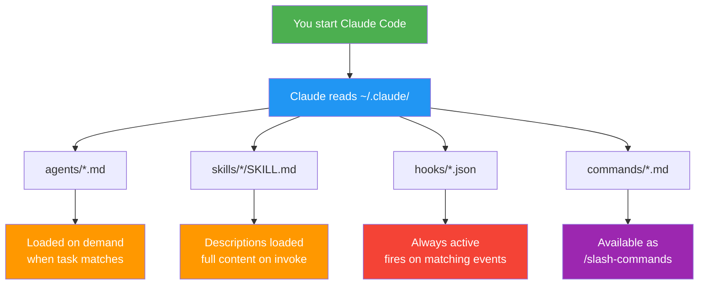
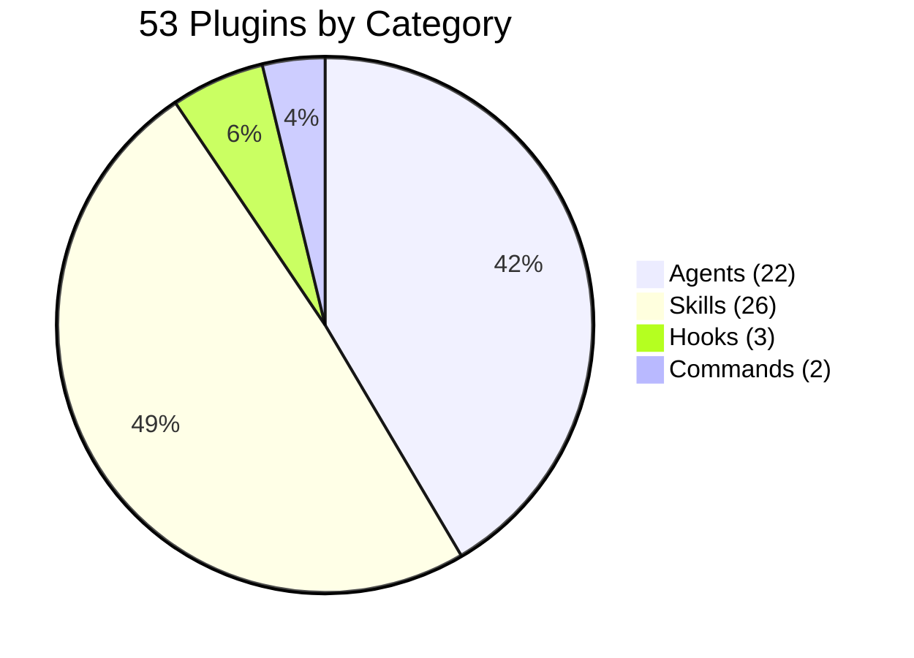
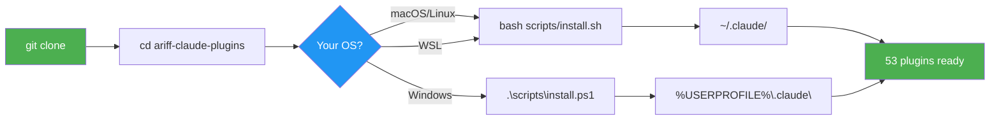
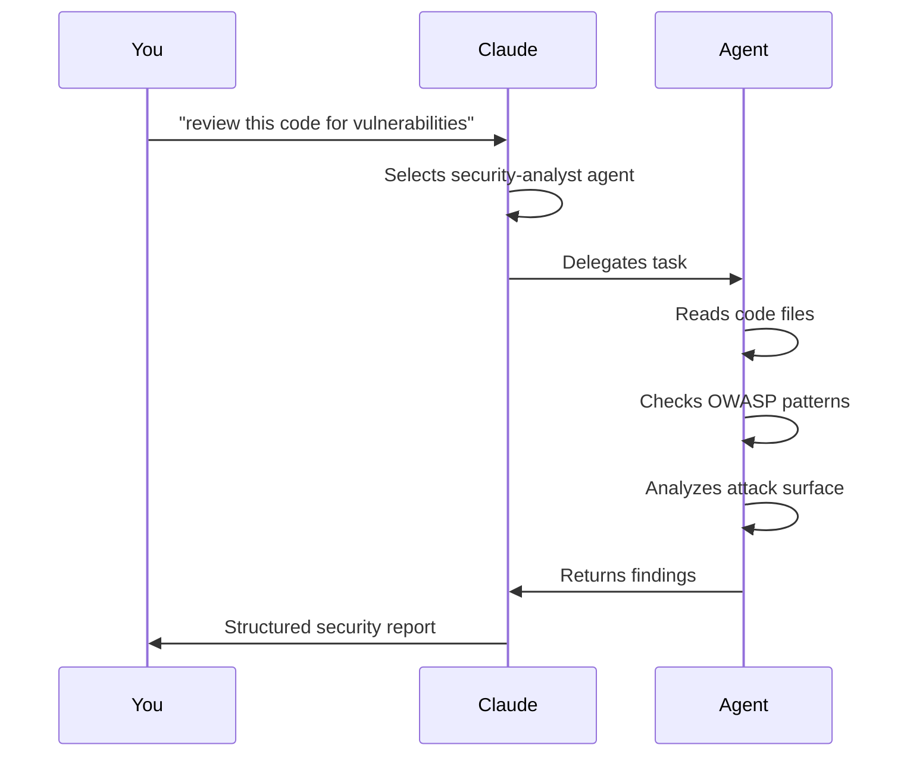

# Claude Code Plugin Marketplace

<div align="center">

[](./marketplace.json)
[](./plugins)
[](./plugins)
[](./plugins)
[](./LICENSE)
[](https://github.com/a-ariff/ariff-claude-plugins/stargazers)

**53 production-ready plugins for Claude Code -- autonomous agents, power skills, smart hooks, and custom commands**

Compatible with Claude Opus 4.6, Sonnet 4.6, and Haiku 4.5

[Quick Start](#quick-start) | [What's Inside](#whats-inside) | [How to Install](#how-to-install-step-by-step) | [Usage Guide](#usage-guide) | [Documentation](#documentation) | [Contributing](#contributing)

</div>

---

## What is this?

Claude Code is Anthropic's CLI tool for coding with AI. **Plugins** extend what Claude Code can do by adding specialized agents, skills, and automation hooks.

This marketplace gives you **53 ready-to-use plugins** that turn Claude Code into an autonomous development powerhouse. Instead of telling Claude what to do step by step, you delegate entire tasks to specialized agents that know exactly how to handle them.

**Before plugins:**
```
You: "Read the auth module, check for SQL injection, review the error handling,
     look at the input validation, check the session management..."
```

**After plugins:**
```
You: "Run a security review on the auth module"
Claude: *security-analyst agent handles everything autonomously*
```

---

## Quick Start

**Prerequisites:** [Claude Code](https://claude.ai/code) and [Git](https://git-scm.com) installed.

**macOS / Linux:**
```bash
git clone https://github.com/a-ariff/ariff-claude-plugins.git
cd ariff-claude-plugins && bash scripts/install.sh
```

**Windows (PowerShell):**
```powershell
git clone https://github.com/a-ariff/ariff-claude-plugins.git
cd ariff-claude-plugins; .\scripts\install.ps1
```

Done. Start a new Claude Code session and all 53 plugins are available.

---

## What's Inside

### 53 Plugins in 4 Categories

```
ariff-claude-plugins/
|
|-- 22 Agents      autonomous workers that handle entire tasks
|-- 26 Skills      methodologies and knowledge you can apply on demand
|--  3 Hooks       automatic safeguards that run without you asking
|--  2 Commands    slash commands for common workflows
```

### Agents (22) -- delegate entire tasks

Agents are autonomous workers. You give them a task, they figure out the approach, use tools, read files, and deliver results.

| Category | Agents | What they do |
|----------|--------|-------------|
| **Development** | architect, backend-dev, frontend-dev, performance-engineer, qa-engineer, security-analyst, refactorer, autonomous-dev-assistant | Build, optimize, test, and secure code |
| **Analysis** | sequential-thinker, project-planner, analyzer, mentor | Plan, analyze, reason through problems |
| **Safety** | context-validator, intent-clarifier, pre-action-verifier, scope-boundary-checker, fact-checker, dependency-validator, rollback-planner | Validate before acting, catch mistakes early |
| **Specialized** | smithery-deployment-agent, smart-routing, setup-orchestrator | Deploy MCP servers, route to optimal models, configure environments |

### Skills (26) -- apply proven methodologies

Skills are knowledge and methodology files that Claude loads when relevant. They teach Claude how to approach specific types of problems.

**Superpowers (9):** brainstorming, writing-plans, executing-plans, subagent-driven-development, verification-before-completion, root-cause-tracing, defense-in-depth, when-stuck, using-superpowers

**Development (12):** github, plugin-creator, plugin-checker, canvas-api, api-docs-generator, ci-cd-helper, code-reviewer, commit-message-generator, error-explainer, performance-optimizer, pr-analyzer, refactor-assistant

**Testing (3):** security-scanner, tdd-workflow, test-writer

**Debugging (2):** systematic-debugger, memory-sync

### Hooks (3) -- automatic safeguards

Hooks run automatically at specific points during Claude's workflow. You don't invoke them -- they watch and act.

| Hook | Event | What it does |
|------|-------|-------------|
| assumption-checker | PreToolUse | Warns when Claude makes assumptions instead of checking |
| memory-sync | Stop | Prompts to save learnings at session end |
| hooks-reference | PreToolUse | Reference implementation for building your own hooks |

### Commands (2) -- slash commands

| Command | Usage | What it does |
|---------|-------|-------------|
| deep-search | `/deep-search "query"` | Multi-source semantic search across GitHub, Reddit, docs |
| task-folder-manager | `/task-folder-manager` | Create dated, organized task folders |

---

## How to Install (Step by Step)

This guide assumes you've never installed a Claude Code plugin before. Pick your platform below.

### Step 1: Make sure Claude Code is installed

Open any terminal and run:
```
claude --version
```

If you see a version number (e.g., `2.1.76`), you're good. If not, install Claude Code first from [claude.ai/code](https://claude.ai/code).

### Step 2: Clone this repository

```
git clone https://github.com/a-ariff/ariff-claude-plugins.git
cd ariff-claude-plugins
```

### Step 3: Run the installer for your platform

<details>
<summary><strong>macOS / Linux (Terminal, iTerm, Warp)</strong></summary>

```bash
bash scripts/install.sh
```
</details>

<details>
<summary><strong>Windows (PowerShell)</strong></summary>

```powershell
# Run from PowerShell (not CMD)
cd ariff-claude-plugins

# Create plugin directories
$claudeDir = "$env:USERPROFILE\.claude"
New-Item -ItemType Directory -Force -Path "$claudeDir\agents"
New-Item -ItemType Directory -Force -Path "$claudeDir\skills"
New-Item -ItemType Directory -Force -Path "$claudeDir\hooks"
New-Item -ItemType Directory -Force -Path "$claudeDir\commands"
New-Item -ItemType Directory -Force -Path "$claudeDir\scripts"

# Copy all plugins
Get-ChildItem plugins -Directory | ForEach-Object {
    $plugin = $_
    # Agents
    if (Test-Path "$($plugin.FullName)\agents") {
        Copy-Item "$($plugin.FullName)\agents\*.md" "$claudeDir\agents\" -Force
    }
    # Skills (directories)
    if (Test-Path "$($plugin.FullName)\skills") {
        Get-ChildItem "$($plugin.FullName)\skills" -Directory | ForEach-Object {
            $dest = "$claudeDir\skills\$($_.Name)"
            New-Item -ItemType Directory -Force -Path $dest | Out-Null
            Copy-Item "$($_.FullName)\*" $dest -Force
        }
        # Skills (flat .md files)
        Get-ChildItem "$($plugin.FullName)\skills\*.md" -ErrorAction SilentlyContinue | ForEach-Object {
            $skillName = $_.BaseName -replace '\.skill$',''
            $dest = "$claudeDir\skills\$skillName"
            New-Item -ItemType Directory -Force -Path $dest | Out-Null
            Copy-Item $_.FullName "$dest\SKILL.md" -Force
        }
    }
    # Hooks
    if (Test-Path "$($plugin.FullName)\hooks\hooks.json") {
        Copy-Item "$($plugin.FullName)\hooks\hooks.json" "$claudeDir\hooks\$($plugin.Name)-hooks.json" -Force
    }
    # Commands
    if (Test-Path "$($plugin.FullName)\commands") {
        Copy-Item "$($plugin.FullName)\commands\*.md" "$claudeDir\commands\" -Force -ErrorAction SilentlyContinue
    }
    # Scripts
    if (Test-Path "$($plugin.FullName)\scripts") {
        Copy-Item "$($plugin.FullName)\scripts\*" "$claudeDir\scripts\" -Force -ErrorAction SilentlyContinue
    }
    Write-Host "  ok  $($plugin.Name)" -ForegroundColor Green
}

Write-Host "`nInstalled all plugins to $claudeDir" -ForegroundColor Cyan
```
</details>

<details>
<summary><strong>Windows (WSL / Git Bash)</strong></summary>

```bash
# If using WSL or Git Bash, the bash script works directly
bash scripts/install.sh
```
</details>

<details>
<summary><strong>VS Code Terminal</strong></summary>

Works with any terminal profile in VS Code:

1. Open VS Code
2. Open terminal: `Ctrl+`` ` (backtick) or `View > Terminal`
3. Select your terminal profile (bash, PowerShell, or zsh)
4. Run the commands for your platform above

If your VS Code terminal is PowerShell, use the PowerShell instructions.
If your VS Code terminal is bash/zsh, use the macOS/Linux instructions.
</details>

<details>
<summary><strong>Windows Terminal</strong></summary>

Windows Terminal supports multiple profiles. Pick the one that matches:

**PowerShell tab:** Use the PowerShell instructions above.

**Git Bash tab:** Use `bash scripts/install.sh`

**WSL tab (Ubuntu/Debian):** Use `bash scripts/install.sh`

**CMD tab:** Not recommended. Switch to PowerShell or Git Bash.
</details>

### Step 4: Verify it worked

Start a new Claude Code session:
```
claude
```

Then type:
```
/browse
```

You should see all 53 plugins listed. If you see them, installation is complete.

### How it works

```
    You clone the repo          Install script copies          Claude Code
    to your machine             components to ~/.claude/       reads them
                                (or %USERPROFILE%\.claude\
                                 on Windows)

    ariff-claude-plugins/       ~/.claude/
    |-- plugins/                |-- agents/     (22 files)
    |   |-- architect/    -->   |-- skills/     (26 dirs)
    |   |-- security/     -->   |-- hooks/      (3 configs)
    |   |-- debugger/     -->   |-- commands/   (2 files)
    |   |-- ...53 total         |-- scripts/    (hook scripts)
    |                           |
    |-- scripts/                Claude Code loads these
    |   |-- install.sh          automatically on startup
    |   |-- install.ps1
```

### Install a single plugin

Don't want all 53? Install just what you need:

**macOS / Linux:**
```bash
bash scripts/install.sh --plugin architect
bash scripts/install.sh --plugin security-analyst
```

**Windows PowerShell** (single plugin):
```powershell
# Example: install just the architect agent
$claudeDir = "$env:USERPROFILE\.claude\agents"
New-Item -ItemType Directory -Force -Path $claudeDir | Out-Null
Copy-Item plugins\architect\agents\*.md $claudeDir -Force
```

### Updating

When new plugins are added:

**macOS / Linux:**
```bash
cd ariff-claude-plugins
git pull origin main
bash scripts/install.sh
```

**Windows PowerShell:**
```powershell
cd ariff-claude-plugins
git pull origin main
# Re-run the PowerShell install block from Step 3
```

### Uninstalling

**macOS / Linux:**
```bash
bash scripts/install.sh --uninstall
```

**Windows PowerShell:**
```powershell
Remove-Item -Recurse -Force "$env:USERPROFILE\.claude\agents"
Remove-Item -Recurse -Force "$env:USERPROFILE\.claude\skills"
Remove-Item -Recurse -Force "$env:USERPROFILE\.claude\hooks"
Remove-Item -Recurse -Force "$env:USERPROFILE\.claude\commands"
Remove-Item -Recurse -Force "$env:USERPROFILE\.claude\scripts"
```

### Troubleshooting

| Problem | Solution |
|---------|----------|
| `claude: command not found` | Install Claude Code first from [claude.ai/code](https://claude.ai/code) |
| `git: command not found` | Install Git from [git-scm.com](https://git-scm.com) |
| Plugins don't show in `/browse` | Restart Claude Code (close and reopen) |
| Permission denied on macOS | Run `chmod +x scripts/install.sh` first |
| PowerShell execution policy | Run `Set-ExecutionPolicy -Scope CurrentUser RemoteSigned` |
| WSL can't find ~/.claude | Make sure you're running Claude Code inside WSL, not Windows |

---

## Usage Guide

### Using Agents

Agents are the most powerful feature. Describe what you want and Claude delegates to the right agent.

**Example workflow:**

```
+-------------------+     +-------------------+     +-------------------+
|                   |     |                   |     |                   |
|  You: "review     |---->|  Claude selects   |---->|  security-analyst |
|  this code for    |     |  security-analyst |     |  reads code,      |
|  vulnerabilities" |     |  agent            |     |  checks OWASP,    |
|                   |     |                   |     |  reports findings  |
+-------------------+     +-------------------+     +-------------------+
```

More examples:
```
"Design a caching layer for my high-traffic API"
  -> architect agent handles system design

"Review this code for security vulnerabilities"
  -> security-analyst agent runs a full review

"Optimize this database query that's taking 3 seconds"
  -> performance-engineer agent profiles and fixes it

"Plan the implementation for this new feature"
  -> project-planner agent breaks it down into steps

"Help me understand how this authentication flow works"
  -> mentor agent explains at your level
```

### Using Skills

Skills are invoked when Claude recognizes a relevant situation, or you can ask directly:

```
"Use the systematic-debugger skill to find this memory leak"
"Apply the brainstorming skill to generate API design alternatives"
"Use verification-before-completion for this deployment"
```

### Using Commands

Slash commands for quick actions:

```
/deep-search "react server components best practices"
/task-folder-manager --name "feature-auth-rewrite"
```

### Using Hooks

Hooks run automatically. No action needed from you.

```
+------------------+     +--------------------+     +------------------+
|                  |     |                    |     |                  |
|  Claude is about |---->|  assumption-checker|---->|  "Warning: you   |
|  to use a tool   |     |  hook fires        |     |  assumed X, did  |
|                  |     |  (PreToolUse)      |     |  you verify it?" |
+------------------+     +--------------------+     +------------------+
```

---

## Architecture

### Plugin loading flow


```mermaid
flowchart TD
    A["You start Claude Code"] --> B["Claude reads ~/.claude/"]
    B --> C["agents/*.md"]
    B --> D["skills/*/SKILL.md"]
    B --> E["hooks/*.json"]
    B --> F["commands/*.md"]

    C --> G["Loaded on demand\nwhen task matches"]
    D --> H["Descriptions loaded\nfull content on invoke"]
    E --> I["Always active\nfires on matching events"]
    F --> J["Available as\n/slash-commands"]

    style A fill:#4CAF50,color:#fff
    style B fill:#2196F3,color:#fff
    style G fill:#FF9800,color:#fff
    style H fill:#FF9800,color:#fff
    style I fill:#f44336,color:#fff
    style J fill:#9C27B0,color:#fff
```

### Plugin distribution


```mermaid
pie title 53 Plugins by Category
    "Agents (22)" : 22
    "Skills (26)" : 26
    "Hooks (3)" : 3
    "Commands (2)" : 2
```

### Install flow


```mermaid
flowchart LR
    A["git clone"] --> B["cd ariff-claude-plugins"]
    B --> C{Your OS?}
    C -->|macOS/Linux| D["bash scripts/install.sh"]
    C -->|Windows| E[".\scripts\install.ps1"]
    C -->|WSL| D
    D --> F["~/.claude/"]
    E --> G["%USERPROFILE%\.claude\"]
    F --> H["53 plugins ready"]
    G --> H

    style A fill:#4CAF50,color:#fff
    style H fill:#4CAF50,color:#fff
    style C fill:#2196F3,color:#fff
```

### Agent workflow


```mermaid
sequenceDiagram
    participant You
    participant Claude
    participant Agent

    You->>Claude: "review this code for vulnerabilities"
    Claude->>Claude: Selects security-analyst agent
    Claude->>Agent: Delegates task
    Agent->>Agent: Reads code files
    Agent->>Agent: Checks OWASP patterns
    Agent->>Agent: Analyzes attack surface
    Agent->>Claude: Returns findings
    Claude->>You: Structured security report
```

### Plugin structure

Every plugin follows this structure:
```
my-plugin/
  .claude-plugin/
    plugin.json          # manifest (name, version, description)
  agents/                # agent definitions (markdown)
  skills/                # skill definitions (markdown)
  hooks/
    hooks.json           # hook event configuration
  commands/              # slash command definitions
  scripts/               # shell scripts for hooks
```

### Supported hook events (22 total)

| Category | Events |
|----------|--------|
| Session | SessionStart, SessionEnd |
| User Input | UserPromptSubmit |
| Tool Use | PreToolUse, PostToolUse, PostToolUseFailure, PermissionRequest |
| Completion | Stop, SubagentStop, TaskCompleted, TeammateIdle |
| Context | PreCompact, PostCompact, InstructionsLoaded |
| Config | ConfigChange |
| Worktree | WorktreeCreate, WorktreeRemove |
| MCP | Elicitation, ElicitationResult |
| System | Notification |

### Compatibility

| Requirement | Details |
|-------------|---------|
| Claude Opus 4.6 | Full support (1M context) |
| Claude Sonnet 4.6 | Full support (1M context) |
| Claude Haiku 4.5 | Full support (200k context) |
| Claude Code version | 2.1+ recommended |
| Operating systems | macOS, Linux, Windows (WSL) |
| Git worktree isolation | Supported |
| MCP integration | Supported (stdio, HTTP, SSE) |

---

## Statistics

| Metric | Count |
|--------|-------|
| Total plugins | 53 |
| Agents | 22 (42%) |
| Skills | 26 (49%) |
| Hooks | 3 (5%) |
| Commands | 2 (4%) |
| Plugin component types | 6 (agents, skills, commands, hooks, MCP servers, LSP servers) |
| Supported hook events | 22 |
| Supported models | 3 (Opus 4.6, Sonnet 4.6, Haiku 4.5) |
| Install time | < 30 seconds |

---

## Documentation

### Guides (start here)
- [Agents Guide](./docs/AGENTS.md) -- what agents are, all 22 agents with descriptions and examples
- [Skills Guide](./docs/SKILLS.md) -- what skills are, all 26 skills with descriptions and examples
- [Hooks Guide](./docs/HOOKS.md) -- what hooks are, all 22 supported events, how to create your own
- [Commands Guide](./docs/COMMANDS.md) -- what commands are, all 2 commands with usage

### Reference
- [Categories Overview](./docs/CATEGORIES.md) -- quick comparison of all plugin types
- [Plugin Structure](./docs/PLUGIN_STRUCTURE.md) -- how to build your own plugins
- [Quick Start](./QUICKSTART.md) -- fast setup (one page)
- [Changelog](./CHANGELOG.md) -- version history
- [Contributing](./CONTRIBUTING.md) -- how to contribute plugins
- [Setup Verification](./SETUP-COMPLETE.md) -- troubleshooting

---

## Use Cases

### For solo developers
- Delegate code reviews to the security-analyst and code-reviewer
- Use project-planner before starting any feature
- Let systematic-debugger find root causes
- Have architect agent design your system before you code

### For teams
- Standardize workflows with shared skills
- Safety checker agents catch mistakes before they ship
- QA engineer agent handles test strategy
- Plugin-creator skill helps build team-specific plugins

### For students
- Mentor agent explains concepts at your level
- Canvas API skill integrates with university LMS
- Sequential-thinker breaks complex problems into steps
- Writing-plans skill teaches you to plan before coding

---

## Contributing

Contributions welcome. See [CONTRIBUTING.md](./CONTRIBUTING.md).

**Quick contribution:**
1. Fork this repository
2. Create your plugin in `plugins/your-plugin/`
3. Run `bash scripts/validate-plugin.sh plugins/your-plugin`
4. Submit a pull request

---

## Why this marketplace?

| Feature | This marketplace | Typical repos |
|---------|-----------------|---------------|
| Production-tested | Yes, 53 plugins | 5-10 experimental plugins |
| Documentation | Full guides, visual diagrams, examples | Basic README |
| Safety layer | 7 checker agents + 3 hooks | None |
| Model support | Opus 4.6, Sonnet 4.6, Haiku 4.5 | Single model |
| One-line install | `bash scripts/install.sh` | Manual file copying |
| Cross-device sync | Git-based, works with any cloud storage | Not supported |
| Updates | `git pull && bash scripts/install.sh` | Manual |

---

## License

MIT License -- see [LICENSE](./LICENSE) for details.

---

## Links

- **Repository**: https://github.com/a-ariff/ariff-claude-plugins
- **Issues**: https://github.com/a-ariff/ariff-claude-plugins/issues
- **Author**: [@a-ariff](https://github.com/a-ariff)

---

If this marketplace is useful to you, consider giving it a star. It helps others find these plugins.
