# 🔌 Ariff's Claude Code Plugin Marketplace

[](./marketplace.json)
[](./plugins)
[](./plugins)
[](./LICENSE)

> Production-ready agents, skills, hooks, and commands for enhanced AI development workflows with Claude Code.

## 📦 Quick Install

```bash
# Clone and install
git clone https://github.com/a-ariff/ariff-claude-plugins.git
cd ariff-claude-plugins
bash scripts/install.sh
```

Or install specific plugins:
```bash
# Install a single plugin
bash scripts/install.sh --plugin architect-agent
```

## 📊 Architecture Overview

### Repository Structure


### Installation Flow

```mermaid
flowchart LR
    A[User runs<br/>install.sh] --> B{Check<br/>Category}

    B -->|agents| C[Copy to<br/>~/.claude/agents/]
    B -->|skills| D[Copy to<br/>~/.claude/skills/]
    B -->|hooks| E[Copy to<br/>~/.claude/hooks/]
    B -->|commands| F[Copy to<br/>~/.claude/commands/]

    C --> G[Verify<br/>Installation]
    D --> G
    E --> G
    F --> G

    G --> H{All OK?}
    H -->|Yes| I[✓ Ready to Use]
    H -->|No| J[Show Errors]

    style A fill:#4CAF50,color:#fff
    style I fill:#4CAF50,color:#fff
    style J fill:#f44336,color:#fff
```



### Plugin Categories Breakdown


### Cross-Device Sync


### How AIs Access Your Setup


## 🎯 Plugin Categories

### 🤖 Agents (21)
Autonomous AI assistants for specialized tasks.

| Agent | Description | Tags |
|-------|-------------|------|
| `architect-agent` | System design and architecture decisions | design, architecture |
| `autonomous-dev-assistant` | Independent development task automation | development, automation |
| `backend-dev` | Server-side development specialist | backend, api |
| `frontend-dev` | UI/UX implementation specialist | frontend, ui |
| `performance-engineer` | Performance optimization specialist | performance, optimization |
| `qa-engineer` | Quality assurance and testing | testing, qa |
| `refactorer` | Code refactoring specialist | refactoring, cleanup |
| `security-analyst` | Security analysis and vulnerability assessment | security, audit |
| `setup-orchestrator` | Project setup and environment configuration | setup, configuration |
| `sequential-thinker` | Step-by-step reasoning and problem solving | reasoning, thinking |
| `project-planner` | Project planning and task breakdown | planning, tasks |
| `analyzer` | Code and system analysis | analysis, code-review |
| `mentor` | Learning guidance and skill development | learning, teaching |
| `smithery-deployment-agent` | Smithery MCP deployment specialist | deployment, mcp |
| `smart-routing` | Model-specific task routing | routing, multi-model |

#### 🛡️ Checker Agents (7)
Safety-first validation agents that prevent errors before they happen.

| Agent | Description |
|-------|-------------|
| `context-validator` | Ensures context is complete and accurate |
| `intent-clarifier` | Clarifies user intent before action |
| `pre-action-verifier` | Verifies prerequisites before actions |
| `scope-boundary-checker` | Ensures actions stay within scope |
| `fact-checker` | Verifies facts against codebase reality |
| `dependency-validator` | Validates package dependencies |
| `rollback-planner` | Plans rollback strategies before changes |

### ⚡ Skills (15)
Reusable capabilities that enhance Claude's abilities.

| Skill | Description | Tags |
|-------|-------------|------|
| `github-operations` | GitHub workflow and automation | github, git |
| `using-superpowers` | Meta-skill for activating superpowers | superpowers, meta |
| `brainstorming` | Structured brainstorming techniques | ideas, superpowers |
| `writing-plans` | Implementation plan creation | planning, superpowers |
| `executing-plans` | Plan execution with verification | execution, superpowers |
| `subagent-driven-development` | Subagent delegation patterns | subagent, superpowers |
| `verification-before-completion` | Pre-completion verification | verification, superpowers |
| `root-cause-tracing` | Root cause analysis techniques | debugging, superpowers |
| `defense-in-depth` | Multi-layer validation approach | validation, superpowers |
| `systematic-debugging` | Systematic debugging methodology | debugging, superpowers |
| `when-stuck` | Techniques for getting unstuck | problem-solving, superpowers |
| `plugin-creator` | Guide for creating Claude Code plugins | plugin-dev, meta |
| `plugin-checker` | Plugin validation and structure verification | plugin-dev, validation |
| `hooks-reference` | Hook events, patterns, and examples | hooks, automation |
| `canvas-api` | Canvas LMS API connection guide | canvas, api, lms |

### 🪝 Hooks (2)
Event-driven automations that run at specific lifecycle points.

| Hook | Description | Trigger |
|------|-------------|---------|
| `assumption-checker` | Validates assumptions before actions | pre-tool-call |
| `memory-sync` | Syncs learnings to mem0 and obsidian | post-response |

### 📋 Commands (2)
Custom slash commands for common workflows.

| Command | Description |
|---------|-------------|
| `task-folder-manager` | Creates dated task folders with device name |
| `deep-search` | Semantic deep search across multiple sources |

## 🏗️ Plugin Structure

Each plugin follows this structure:

```
plugins/
└── plugin-name/
    ├── manifest.json     # Plugin metadata
    ├── plugin-name.md    # Main plugin file (agent/skill/etc)
    └── README.md         # Documentation (optional)
```

### Manifest Schema

```json
{
  "name": "plugin-name",
  "version": "1.0.0",
  "description": "What this plugin does",
  "category": "agents|skills|hooks|commands",
  "tags": ["tag1", "tag2"],
  "files": ["plugin-name.md"],
  "dependencies": []
}
```

## 🔧 Usage Examples

### Using an Agent
```
@architect-agent Design a scalable microservices architecture for an e-commerce platform
```

### Using a Skill
```
Use the systematic-debugging skill to find the root cause of this memory leak
```

### Using Superpowers
```
ultrathink about this architecture decision using the brainstorming superpower
```

## 📊 Statistics

| Category | Count | Description |
|----------|-------|-------------|
| **Agents** | 21 | Autonomous task specialists |
| **Skills** | 15 | Reusable capabilities |
| **Hooks** | 2 | Event-driven automations |
| **Commands** | 2 | Custom slash commands |
| **Total** | **41** | Production-ready plugins |

## 🤝 Contributing

See [CONTRIBUTING.md](./CONTRIBUTING.md) for guidelines on:
- Creating new plugins
- Plugin structure requirements
- Testing your plugins
- Submitting pull requests

## 📜 License

MIT License - see [LICENSE](./LICENSE) for details.

## 🙏 Acknowledgments

- [Claude Code](https://claude.ai/code) by Anthropic
- [Smithery](https://smithery.ai/) for MCP hosting
- The Claude Code community

---

**Author:** [Ariff](https://github.com/a-ariff) | **Version:** 2.0.0 | **Updated:** 2025-12-22
