# 🔌 Claude Code Plugin Marketplace

<div align="center">

[](./marketplace.json)
[](./plugins)
[](./plugins)
[](./LICENSE)
[](https://github.com/a-ariff/ariff-claude-plugins/stargazers)

**Production-ready plugins that supercharge Claude Code with autonomous agents, powerful skills, smart hooks, and custom commands**

[Quick Start](#-quick-start) • [Features](#-features) • [Documentation](#-documentation) • [Install](#-installation) • [Contributing](#-contributing)

</div>

---

## 🎯 Why This Marketplace?

Transform Claude Code from a powerful assistant into an **autonomous development powerhouse**:

- **🤖 21 Specialized Agents** - Delegate complex tasks to expert agents
- **⚡ 15 Power Skills** - Apply proven methodologies instantly
- **🛡️ Smart Safety Hooks** - Prevent mistakes before they happen
- **📋 Workflow Commands** - Automate repetitive tasks
- **🔄 Cross-Device Sync** - Same setup on all your machines
- **📦 One-Line Install** - Up and running in 30 seconds

## ⚡ Quick Start

```bash
git clone https://github.com/a-ariff/ariff-claude-plugins.git && \
cd ariff-claude-plugins && bash scripts/install.sh
```

**That's it!** All 41 plugins are now available in your Claude Code session.

## 🌟 Features

### 🤖 Autonomous Agents (21)

Delegate entire tasks to specialized AI agents that work independently:

```bash
@architect-agent Design a scalable microservices architecture for my e-commerce platform
```

| Category | Agents | What They Do |
|----------|--------|--------------|
| **Development** (8) | architect, backend-dev, frontend-dev, performance-engineer, qa-engineer, security-analyst, refactorer, autonomous-dev-assistant | Build, optimize, and secure your code |
| **Analysis** (4) | sequential-thinker, project-planner, analyzer, mentor | Plan, analyze, and guide your work |
| **Safety Checkers** (7) | context-validator, intent-clarifier, pre-action-verifier, scope-boundary-checker, fact-checker, dependency-validator, rollback-planner | Validate before acting, prevent errors |
| **Specialized** (2) | smithery-deployment-agent, smart-routing | Deploy MCP servers, optimize model usage |

### ⚡ Power Skills (15)

Apply proven methodologies instantly:

```bash
Use the systematic-debugging skill to find the root cause of this memory leak
```

**Superpowers** (10): brainstorming, writing-plans, executing-plans, subagent-driven-development, verification-before-completion, root-cause-tracing, defense-in-depth, systematic-debugging, when-stuck, using-superpowers

**Development** (3): github-operations, plugin-creator, plugin-checker

**Reference** (2): hooks-reference, canvas-api

### 🛡️ Smart Hooks (2)

Automatic safeguards that run without you asking:

- **assumption-checker** - Warns when Claude makes assumptions, enforces Canvas LMS verification
- **memory-sync** - Prompts to save learnings to mem0 and Obsidian at session end

### 📋 Custom Commands (2)

Slash commands for common workflows:

- `/deep-search` - Multi-source semantic search (GitHub, Reddit, docs)
- `/task-folder-manager` - Create dated, organized task folders

## 📊 Architecture

### How It Works

```mermaid
graph LR
    A[👤 User] -->|installs| B[ariff-claude-plugins]
    B -->|copies to| C[~/.claude/]
    C -->|loads| D[🤖 Claude Code]

    D -->|uses| E[21 Agents]
    D -->|applies| F[15 Skills]
    D -->|triggers| G[2 Hooks]
    D -->|runs| H[2 Commands]

    E --> I[💪 Supercharged Claude]
    F --> I
    G --> I
    H --> I

    style A fill:#4CAF50,color:#fff
    style I fill:#FF9800,color:#fff
    style D fill:#2196F3,color:#fff
```



### Installation Flow

```mermaid
flowchart TD
    START[🚀 Run install.sh] --> CHECK{Detect OS}

    CHECK -->|macOS/Linux| UNIX[Unix Install]
    CHECK -->|Windows| WIN[Windows Install]

    UNIX --> COPY[📦 Copy Plugins]
    WIN --> COPY

    COPY --> CAT{Check Category}

    CAT -->|Agent| A[~/.claude/agents/]
    CAT -->|Skill| S[~/.claude/skills/]
    CAT -->|Hook| H[~/.claude/hooks/]
    CAT -->|Command| C[~/.claude/commands/]

    A --> VERIFY[✅ Verify Install]
    S --> VERIFY
    H --> VERIFY
    C --> VERIFY

    VERIFY --> SUCCESS[🎉 Ready to Use!]

    style START fill:#4CAF50,color:#fff
    style SUCCESS fill:#4CAF50,color:#fff
    style CHECK fill:#2196F3,color:#fff
```



### Plugin Distribution


### Complete Plugin Tree

```mermaid
graph TD
    ROOT["🔌 41 Plugins"]

    ROOT --> AGENTS["🤖 Agents (21)"]
    ROOT --> SKILLS["⚡ Skills (15)"]
    ROOT --> HOOKS["🛡️ Hooks (2)"]
    ROOT --> CMDS["📋 Commands (2)"]

    AGENTS --> A1["👨‍💻 Development (8)"]
    AGENTS --> A2["🧠 Analysis (4)"]
    AGENTS --> A3["✅ Checkers (7)"]
    AGENTS --> A4["🎯 Specialized (2)"]

    A1 --> A1a["architect"]
    A1 --> A1b["backend-dev"]
    A1 --> A1c["frontend-dev"]
    A1 --> A1d["performance-engineer"]
    A1 --> A1e["qa-engineer"]
    A1 --> A1f["security-analyst"]
    A1 --> A1g["refactorer"]
    A1 --> A1h["autonomous-dev-assistant"]

    A2 --> A2a["sequential-thinker"]
    A2 --> A2b["project-planner"]
    A2 --> A2c["analyzer"]
    A2 --> A2d["mentor"]

    A3 --> A3a["context-validator"]
    A3 --> A3b["intent-clarifier"]
    A3 --> A3c["pre-action-verifier"]
    A3 --> A3d["scope-boundary-checker"]
    A3 --> A3e["fact-checker"]
    A3 --> A3f["dependency-validator"]
    A3 --> A3g["rollback-planner"]

    A4 --> A4a["smithery-deployment-agent"]
    A4 --> A4b["smart-routing"]

    SKILLS --> S1["🌟 Superpowers (10)"]
    SKILLS --> S2["🛠️ Development (3)"]
    SKILLS --> S3["📚 Reference (2)"]

    S1 --> S1a["brainstorming"]
    S1 --> S1b["writing-plans"]
    S1 --> S1c["executing-plans"]
    S1 --> S1d["subagent-driven-development"]
    S1 --> S1e["verification-before-completion"]
    S1 --> S1f["root-cause-tracing"]
    S1 --> S1g["defense-in-depth"]
    S1 --> S1h["systematic-debugging"]
    S1 --> S1i["when-stuck"]
    S1 --> S1j["using-superpowers"]

    S2 --> S2a["github-operations"]
    S2 --> S2b["plugin-creator"]
    S2 --> S2c["plugin-checker"]

    S3 --> S3a["hooks-reference"]
    S3 --> S3b["canvas-api"]

    HOOKS --> H1["assumption-checker<br/>(PreToolUse)"]
    HOOKS --> H2["memory-sync<br/>(Stop)"]

    CMDS --> C1["deep-search"]
    CMDS --> C2["task-folder-manager"]

    style ROOT fill:#9C27B0,color:#fff
    style AGENTS fill:#4CAF50,color:#fff
    style SKILLS fill:#FF9800,color:#fff
    style HOOKS fill:#2196F3,color:#fff
    style CMDS fill:#f44336,color:#fff
```



### Cross-Device Sync

```mermaid
sequenceDiagram
    participant M as 💻 Mac
    participant O as ☁️ OneDrive
    participant W as 🖥️ Windows
    participant G as 🐙 GitHub

    Note over M,G: Seamless Multi-Device Workflow

    M->>O: Save changes locally
    O->>W: Auto-sync via cloud

    M->>G: git push updates
    W->>G: git pull updates

    Note over M,W: Both devices always in sync

    W->>W: Run setup-device.sh
    Note over W: Installs to ~/.claude/

    M->>M: Run setup-device.sh
    Note over M: Installs to ~/.claude/
```



## 🚀 Installation

### Prerequisites

- [Claude Code](https://claude.ai/code) installed
- Git installed
- macOS, Linux, or Windows

### Method 1: Quick Install (Recommended)

```bash
git clone https://github.com/a-ariff/ariff-claude-plugins.git
cd ariff-claude-plugins
bash scripts/install.sh
```

### Method 2: Install Single Plugin

```bash
bash scripts/install.sh --plugin architect-agent
```

### Method 3: Manual Install

```bash
# Copy specific category
cp -r plugins/architect ~/.claude/agents/
```

## 📖 Usage Examples

### Using Agents

```bash
# Delegate system design
@architect-agent Design a caching layer for high-traffic API

# Security review
@security-analyst Review this authentication code for vulnerabilities

# Performance optimization
@performance-engineer Optimize this database query
```

### Using Skills

```bash
# Apply debugging methodology
Use the systematic-debugging skill to investigate this bug

# Brainstorm solutions
Apply the brainstorming skill to generate API design alternatives

# Execute with verification
Use the verification-before-completion skill for this deployment
```

### Using Commands

```bash
# Deep search across sources
/deep-search "react server components best practices" --sources github,docs

# Create organized task folder
/task-folder-manager --name "new-feature-implementation"
```

## 💡 Use Cases

### For Solo Developers

- **Code faster** with specialized development agents
- **Learn continuously** with the mentor agent
- **Catch errors early** with safety checker agents
- **Organize work** with task management commands

### For Teams

- **Standardize workflows** with shared skills
- **Document decisions** with architecture agents
- **Ensure quality** with QA and security agents
- **Onboard quickly** with reference skills

### For Students

- **Learn best practices** from specialized agents
- **Debug systematically** with debugging skills
- **Plan projects** with project-planner agent
- **Integrate with Canvas LMS** using canvas-api skill

## 🎓 Documentation

- [Plugin Structure Guide](./docs/PLUGIN_STRUCTURE.md) - How plugins work internally
- [Categories Guide](./docs/CATEGORIES.md) - Detailed breakdown of each category
- [Contributing Guide](./CONTRIBUTING.md) - How to create your own plugins
- [Setup Complete Guide](./SETUP-COMPLETE.md) - Verification and troubleshooting

## 🌍 Cross-Device Setup

Your plugins sync across all devices:

1. **Install on Device 1** (Mac):
   ```bash
   bash scripts/install.sh
   ```

2. **Auto-sync via OneDrive** - Changes sync automatically

3. **Install on Device 2** (Windows):
   ```powershell
   .\scripts\install.ps1
   ```

All devices stay synchronized with the same plugin configuration.

## 🔧 Advanced Usage

### Create Your Own Plugin

```bash
# Use the plugin-creator skill
Use the plugin-creator skill to make a new database optimization agent
```

### Validate Plugin Structure

```bash
bash scripts/validate-plugin.sh plugins/your-plugin
```

### Update from Marketplace

```bash
cd ariff-claude-plugins
git pull origin main
bash scripts/install.sh
```

## 🤝 Contributing

We welcome contributions! See [CONTRIBUTING.md](./CONTRIBUTING.md) for guidelines.

**Quick contribution:**
1. Fork this repository
2. Create your plugin in `plugins/your-plugin/`
3. Add to `marketplace.json`
4. Submit pull request

## 📊 Statistics

| Metric | Count |
|--------|-------|
| **Total Plugins** | 41 |
| **Agents** | 21 (51%) |
| **Skills** | 15 (37%) |
| **Hooks** | 2 (5%) |
| **Commands** | 2 (5%) |
| **Lines of Code** | 5,000+ |
| **Documentation Pages** | 8 |
| **Install Time** | < 30 seconds |

## 🌟 Why Choose This Marketplace?

| Feature | This Marketplace | Others |
|---------|------------------|--------|
| **Ready to Use** | ✅ Production-tested | ⚠️ Experimental |
| **Comprehensive** | ✅ 41 plugins | ❌ 5-10 plugins |
| **Documentation** | ✅ Complete guides | ⚠️ Basic README |
| **Safety** | ✅ Checker agents | ❌ No validation |
| **Cross-Device** | ✅ Auto-sync | ❌ Manual setup |
| **One-Line Install** | ✅ Automated | ⚠️ Complex setup |
| **Updates** | ✅ Easy git pull | ❌ Manual updates |

## 📜 License

MIT License - see [LICENSE](./LICENSE) for details.

Free to use, modify, and distribute. Attribution appreciated!

## 🙏 Acknowledgments

- [Claude Code](https://claude.ai/code) by Anthropic
- [Smithery](https://smithery.ai/) for MCP hosting
- The Claude Code community

## 🔗 Links

- **Repository**: https://github.com/a-ariff/ariff-claude-plugins
- **Issues**: https://github.com/a-ariff/ariff-claude-plugins/issues
- **Discussions**: https://github.com/a-ariff/ariff-claude-plugins/discussions
- **Author**: [@a-ariff](https://github.com/a-ariff)

## ⭐ Star This Repo

If you find this marketplace useful, please consider starring it! ⭐

It helps others discover these powerful plugins.

---

<div align="center">

**Made with ❤️ for the Claude Code community**

[⬆ Back to Top](#-claude-code-plugin-marketplace)

</div>
